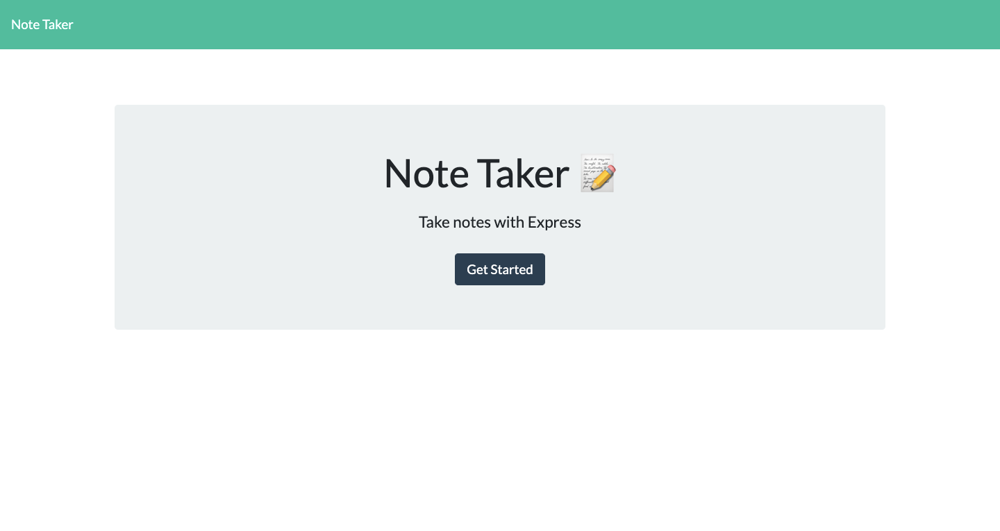
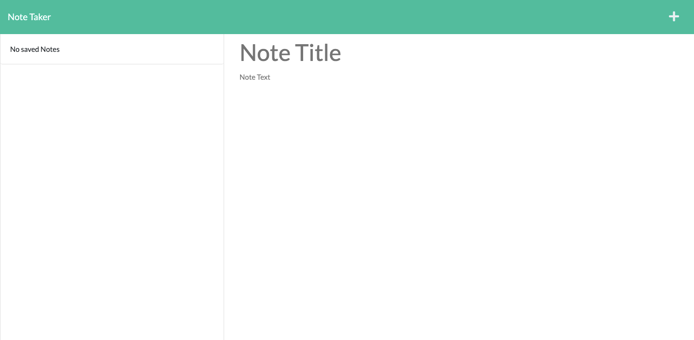

# Note Taker

## Description
This is a note taker app
 that can be used to write and save notes. This application will use an Express.js back end and will save and retrieve note data from a JSON file.

The application will be started by using the following command: node server.js

## Table of Contents

- [Description](#Description)

- [Installation](#Installation)

- [Usage](#Usage)

- [License](#License)

- [Questions](#Questions)

## Installation

To install dependencies, run the following command: npm install

## Usage

Navigate to the folder of the project files and run node server.js in the commande line

Open the website. Click the Get Started button. Enter your note's title and text into the appropriate fields.

Click the Save icon in the navigation bar in the top right of the screen.

## Screenshot

Application preview:

[Live Application](https://whispering-reaches-08280.herokuapp.com/)

## Credits

This project was created using (EXPRESS.JS)
- [Node.js](https://nodejs.org/en/)

## Questions

If you have any questions, please fell free to contact me:

[Email](chambersg16@yahoo.com)

[GitHub Profile](https://github.com/Gcoder9/notetaker1)

## License

NOTE TAKER is licensed under [MIT](https://choosealicense.com/licenses/mit)

Copyright (c) 2022 Greg Chambers